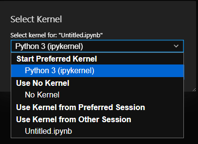
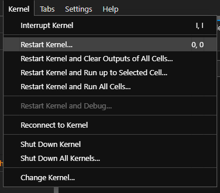
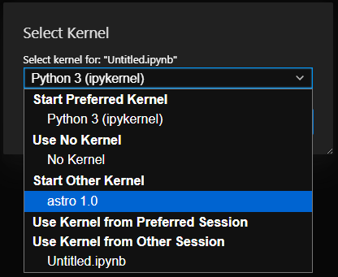
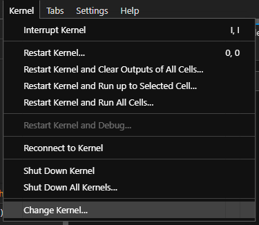
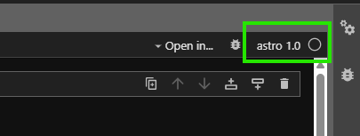

ICRN Jupyter Kernel (User)
=========================

This section provides user guides for Jupyter kernels in the ICRN environment.

How to Add Jupyter Kernel
-------------------------

To add a Jupyter kernel to your ICRN environment:

1. **Get the kernel**:

   .. code-block:: bash

      icrn_manager kernels get Python <kernel_name> <version>

2. **Use the kernel**:

   .. code-block:: bash

      icrn_manager kernels use Python <kernel_name> <version>

3. **Verify installation**:

   .. code-block:: bash

      jupyter kernelspec list

4. **Restart Jupyter**:
   - In JupyterLab: Kernel → Restart All Kernels
   - In Jupyter Notebook: Kernel → Restart

Using Kernels in Jupyter
------------------------

After installing a kernel, you need to restart your Jupyter session to see the new kernel available.

**Before Kernel Installation**

When you first open Jupyter, you'll see only the default kernels available:

**Restarting the Kernel**

After installing a new kernel, restart your Jupyter kernel to refresh the kernel list:

**Selecting a New Kernel**

After restarting, you should see your new kernel in the kernel selection menu:

**Changing to the New Kernel**

Use the kernel menu to switch to your new kernel:

**Verifying the Kernel is Running**

Once selected, you should see the kernel name in the top right of your notebook:

How to Remove Jupyter Kernel
----------------------------

To remove a Jupyter kernel from your ICRN environment:

1. **Stop using the kernel**:

   .. code-block:: bash

      icrn_manager kernels use Python none

2. **Verify removal**:

   .. code-block:: bash

      jupyter kernelspec list

Troubleshooting
--------------

**Kernel Not Appearing in Jupyter**

1. Make sure you ran the ``use`` command after the ``get`` command
2. Restart your Jupyter kernel
3. Check that the kernel was installed correctly:

   .. code-block:: bash

      jupyter kernelspec list

**Permission Errors**

If you encounter permission errors, ensure you have write access to your home directory and the Jupyter kernel directory.

**Kernel Installation Fails**

If kernel installation fails:

1. Check that the kernel package was downloaded correctly
2. Verify your user catalog is properly configured

.. note::
   Always restart your Jupyter session after making changes to kernel configurations. 